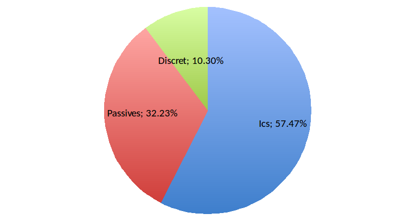

Analysis
========

The reliability of the circuit was determined in tree steps:
 - Lookup for manufacturer data or compute individual component reliability.
 - Compute the block reliability by summing the FITs of the components making the block.
 - Compute the circuit reliability by summit the block FITs.

Per-component failure rate
--------------------------

The following table gives the Failure rate for each component type in the circuit:

Most FITS for the ICs have been taken from manufacturer data. In the table, the cell in orange have been determined by analogy, cell in blue where computed using the "MTBF calculator" This has been done for two IC. Both IC (MT41J128M16HA-15E and M25P32-VMF6P) are manufactured by *Micron Technology* that provides no reliability data.

The **MT41J128M16HA-15E** is a 2Gbit DRAM from Micron, organized in 16Meg * 16bits * 8 Banks. Data from *Allicance Memory* AS4C32M16D1A-5TIN where use instead. This device is a DRAM organized in 8Meg * 16bits * 4 banks. The manufacturer specify the reliability of this device to 11 FIT. As this device is 4 times smaller that MT41J128M16HA-15E, we can determine a equivalent FIT of 44, so that the reliability is proportional to the memory size.

The **M25P32-VMF6P** is a 32Mb Low-Voltage Serial NOR Flash. As no manufacturer data was available, data from a similar device has been used. Data for *Microchip* have been used. Microchip offers data from the whole 25 family with an FIT of 57.

The **GENNUM GN4124** i is a PCI-Express to local bus bridge. The manufacture (*Gennum*) does not provide reliability data. As this IC is an ASIC (Application Specific IC), it is not possible to estimate a FIT from a similar component. In this case, it is mandatory to use the "MTBF calculator" program. For this device, The program compute a FIT of 50. 

Other Passive and discrete component FITs have been computed using the *MTBF calculator* program. When using this program, it is important to choose the **IEC-62380** predication model to set the appropriate norm and the **GF** mission profile. GF mission profile stand from "Ground Fix". As our circuit is a PC card, this seems to be the appropriate profile. 

The figure :numref:`fit-dist` gives an overview of the FIT distribution over the various component types. We can see that for this circuit, the ICs are the larger contributors.

.. _fit-dist:

    
    FIT distribution over component types.
    
Not that for the passive components, only the technology and package have influence on the failure rate. Component value have no influence. As this board is only populated with think film SMD resistance, it is only necessary to make the computation once and use the same value for all resistors. They are two type of capacitor on this board, Aluminum solid electrolytic and X7R ceramic capacitor. So there is only two FIT to compute for the capacitors. All inductor are power inductor and share also the same reliability. 

For the discrete component, design parameters (rated current, power, etc...) and package are taken into account. So there is one calculation to do for each part number.

Per-block failure rate
----------------------

To compute the per-block FITs, all component have been associated with the appropriate block. As passive components (R, L and C) have same reliability, it is easier to count the component per block (count the number of resistor, capacitor and inductors in each block). This process can be done using a spread sheet and indicating the number of each component type in each block. Of course component that appears only once in the BOM like the FPGA are only counted in one block, but this is a generic process. Then the FIT for the component type is multiplied with the component count for the block. This gives the contribution of the component type to the block reliability. All those contribution are summed to compute the FIT for the block. This process leads to the following table:

.. image:: img/FIT_table.png

The result of this calculation can be summarized in the following table:

+--------------------+-------------+
| Block              | Reliability |
+====================+=============+
| Power  Supply	     |  148 FIT    |
+--------------------+-------------+
| Clock Generation   |  122 FIT    |
+--------------------+-------------+
| PCI-Express Bridge |	144 FIT    |
+--------------------+-------------+
| FPGA	             |  167 FIT    |
+--------------------+-------------+
| DRAM	             |   62 FIT    |
+--------------------+-------------+
| FMC interface	     |   38 FIT    |
+--------------------+-------------+

Represented in a graphics, this gives the :numref:`fr_by_block`. This figure shows that the larger contributor is the FPGA block, manly because all the large amount of decoupling capacitors. Then comes the Power supply equals with the PCI-Express bridge block.

.. _fr_by_block:
.. figure:: img/FR_dist_by_func.png
    :scale: 70%

    Failure rate distribution by block.
    

Circuit failure rate
--------------------

As all block are necessary for the circuit proper function, the circuit failure rate is simply computed by summing the FIT from all blocks:

+--------------------+-------------+
| Block              | Reliability |
+====================+=============+
| Power  Supply	     |  148 FIT    |
+--------------------+-------------+
| Clock Generation   |  122 FIT    |
+--------------------+-------------+
| PCI-Express Bridge |	144 FIT    |
+--------------------+-------------+
| FPGA	             |  167 FIT    |
+--------------------+-------------+
| DRAM	             |   62 FIT    |
+--------------------+-------------+
| FMC interface	     |   38 FIT    |
+--------------------+-------------+
| **Total**          | **681 FIT** |
+--------------------+-------------+
| **MTBF**           | **168 Year**|
+--------------------+-------------+

So the whole circuit have 681 FIT, this is equivalent to a MTBF of 1468230 hours which is approximative 168 years. 

**Note**** that this calculation does not take into account the reliability of the bare PCB and the connections (solders). This is because those data were unknown.

Using the exponential law, we can compute the following relations:

+----------+---------------------+
| Time     | Survival population |
+==========+=====================+
| 10 ans   | 94.2%               |
+----------+---------------------+
| 30 ans   | 83.6%               | 
+----------+---------------------+
| 50 ans   | 74.2%               |
+----------+---------------------+
| 100 ans  | 55%                 |
+----------+---------------------+
| ~18 ans  | 90%                 |
+----------+---------------------+
| 116 ans  | 50%                 |
+----------+---------------------+
| 773 ans  | 10%                 |
+----------+---------------------+

Conclusion
==========

This project was a simple example to show the process of computing a electronic circuit card reliability. But already, it shows all the difficulties and the problems linked to it, getting thermostable manufacturer data for example.

