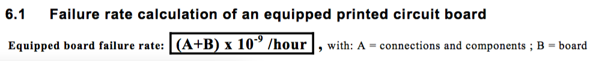
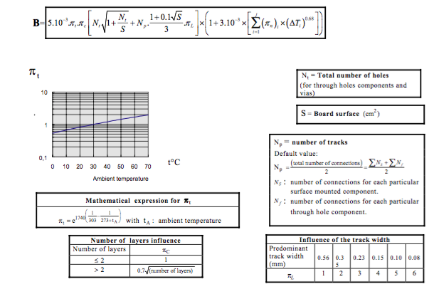
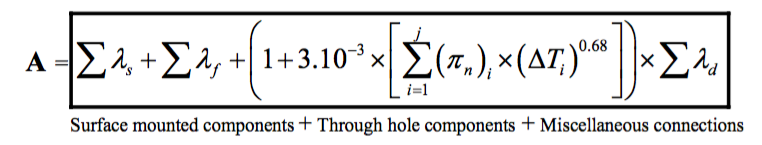
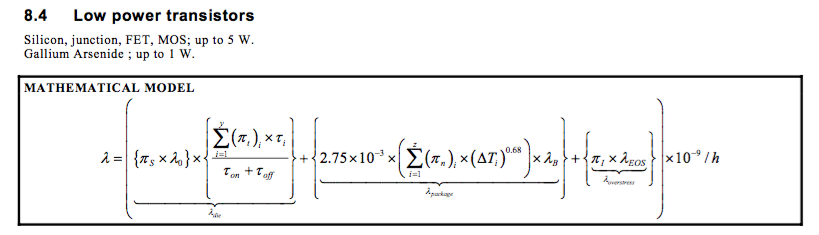

Theorical background
====================

FIT calculation
---------------

The key parameter for reliablity calculation is the "failure rate", denoted :math:`\lambda` and expressed in "FIT". FIT stands for "Failures In Time". One FIT represent on failure per :math:`10^9` hours, or :math:`10^{-9}` failure per hours. The "Mean Time Between Failures" or MTBF is the inverse of the FIT:

.. math::
    MTBF = \frac{10^9}{\lambda}

The failure rate of a complex system, here a fitted PCB, can be calculated from the FIT from the components it is made of. When the component or sub-system are inter-dependent (when the failure of one component affects another) FIT can be added.

.. math::
    \lambda_{T} = \lambda_{IC1} + \lambda_{IC2}
    
When two component of sub-systems are redondant (the same function is implemented twice), FIT can be calculated as follow:

.. math::
    \lambda _{T} = \frac{1}{ \frac{1}{ \lambda_{IC1}} + \frac{1}{\lambda_{IC2} } }
    

IEC 62300
---------

The reliablity of a PCB cicrcuit can be calucated using the guide lines described in the IEC-62380. Other standard applies to specific domains (Space, Aero, etc..) or companies, but IEC-62380 can be used in general cases for Electronics.

This norm gives equation to computes the failure rate in FITs of all component encounter on an electronic circuits as whel equation to compute the reliability of the bare PCB and finaly to compute the Failure rate of the whole assembled PCB. 

The norm start by giving the equation to compute the FITs for an assembled PCB:

    
    IEC-62380 equation to compute FIT for an assembled PCB.

This tells that the the failure rate of the assebled PCB is the failure rate of the components an connections (**A** in the equations) plus the failure rate of the bare PCB (**B** in the equation).

Then the norm gives the equation to compute the failure rate of the bare PCB as follow:

    
    IEC-62380 equation to compute FIT for a bare PCB.

And the failure rate of components and connections:

    
    IEC-62380 equation to compute FIT for an components and connections.

The norms then gives equation to compute the failure rate of all different components that one can find on a PCB board (transistors, diodes, passives, ICs, etc..). Here after is an example for a low power transistor:

    
    IEC-62380 equation to compute FIT for a low power transistor.

This norms can guide the reliabilty engineer to manualy calculate the reliability of the designed PCB cuircuit. However, we can see that the aboves equations are faireley complicated. Such a manual calculation can take some time. Luckly, there the "MTBF calculator by ALD" can help. This program use all the equations given in the norm to compute the MTBF for all component type for all majors norms. This program is available as a freeware at http://aldservice.com/Reliability-Software/free-mtbf-calculator.html.

The failure rate can then be used to compute survival probality.

Survival probality
------------------

In general, we can modelize the survival probality using a negative exponential function as follow:

.. math::
    R(t) = e^{-\lambda t}

This expression gives out a survival population in percent for a given system with known reliability :math:`\lambda`. Note that in this equation, :math:`\lambda` muste be given in failure per hours, so :math:`\lambda = FIT \cdot 10^{-9}`. This model applly to the "useafull life" of the system. It doesn't fit to the early life and the wear out period.

The MTBF definition also comes from this model:

.. math::
    R(MTBF) = e^{ -\lambda * \frac{1}{\lambda} } = e^{-1} = 0.368
    
Statisticaly, when reaching the MTBF a popultaion of 36.8% must remains functional.

