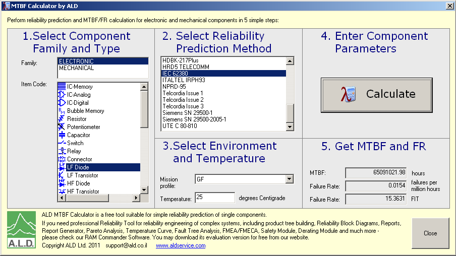
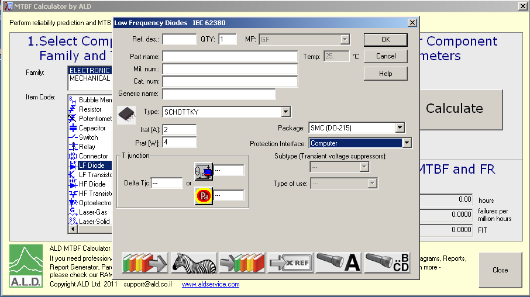

Theoretical background
======================

FIT calculation
---------------

The key parameter for reliability calculation is the "failure rate", denoted :math:`\lambda` and expressed in "FIT". FIT stands for "**F**\ ailures **I**\ n **T**\ ime". One FIT represent on failure per :math:`10^9` hours, or :math:`10^{-9}` failure per hours. The "Mean Time Between Failures" or MTBF is the inverse of the failure rate in FIT:

.. math::
    MTBF = \frac{10^9}{\lambda}

The failure rate of a complex system, here the fitted PCB, can be calculated from the FIT from the components or sub-systems it is made of. When the component or sub-system are inter-dependent (when the failure of one component affects the others) FIT must be added.

.. math::
    \lambda_{T} = \lambda_{IC1} + \lambda_{IC2}
    
When two component of sub-systems are redundant (the same function is implemented twice and can remplace each other), FIT can be calculated as follow:

.. math::
    \lambda _{T} = \frac{1}{ \frac{1}{ \lambda_{IC1}} + \frac{1}{\lambda_{IC2} } }
    

IEC 62300
---------

The reliability of a PCB circuit can be calumniated using the guidelines described in the IEC-62380. Other standard applies to specific domains (Space, Aero, etc..) or can be specific to companies, but IEC-62380 can be used in general cases for Electronics.

This norm gives equation to computes the failure rate in FITs of all component encounter on an electronic circuits as wheel equation to compute the reliability of the bare PCB and finally to compute the failure rate of the whole assembled PCB. 

The norm start by giving the equation to compute the FITs for an assembled PCB:

.. figure:: img/IEC-62380-6.1.png
    :scale: 75%
    :alt: FIT equation for assembled PCB
    
    IEC-62380 equation to compute FIT for an assembled PCB.

This tells that the the failure rate of the assembled PCB is the failure rate of the components an connections (**A** in the equations) plus the failure rate of the bare PCB (**B** in the equation).

Then the norm gives the equation to compute the failure rate of the bare PCB as shown in :numref:`IEC-62380-B`. One can see that the failure rate of the bare board depend on the number of tracks, holes, layers and to the board surface:

.. _IEC-62380-B:
.. figure:: img/IEC-62380-B.png
    :scale: 75%
    :alt: FIT equation for bare PCB
    
    IEC-62380 equation to compute FIT for a bare PCB.

The figure :numref:`IEC-62380-A` show the equation to compute the FIT for the components. This equation simply shows that we must add the faiure raite of Surface mounted component, trough holes components and other micellaneous connections:

.. _IEC-62380-A:
.. figure:: img/IEC-62380-A.png
    :scale: 75%
    :alt: FIT equation for assembled PCB
    
    IEC-62380 equation to compute FIT for an components and connections.

The norms then gives equation to compute the failure rate of all different components that one can find on a PCB board (transistors, diodes, passives, ICs, etc..). The :numref:`IEC-62380-8_4` is an example for a low power transistor:

.. _IEC-62380-8_4:
.. figure:: img/IEC-62380-8.4.png
    :scale: 75%
    :alt: FIT equation for low power transistor
    
    IEC-62380 equation to compute FIT for a low power transistor.

This norms can guide the reliability engineer to manual calculate the reliability of the designed circuit. However, we can see that the aboves equations are fairly complicated. Such a manual calculation can take some time. Luckily, there the "MTBF calculator by ALD" can help. This program use all the equations given in the norm to compute theFIT number and MTBF for all component type and for all majors norms, included IEC-62380. This program is available as a free-ware at http://aldservice.com/Reliability-Software/free-mtbf-calculator.html.

The failure rate can then be used to compute survival probability.

Survival probability
--------------------

In general, we can model the survival probability using a negative exponential function as follow:

.. math::
    R(t) = e^{-\lambda t}

This expression gives out a survival population in percent for a given system with known reliability :math:`\lambda`. Note that in this equation, :math:`\lambda` must be given in failure per hours, so :math:`\lambda = FIT \cdot 10^{-9}`. This model apply to the "useful life" of the system. It doesn't apply to the early life and the wear out period.

The MTBF definition also comes from this model:

.. math::
    R(MTBF) = e^{ -\lambda * \frac{1}{\lambda} } = e^{-1} = 0.368

Statistically, when reaching the MTBF, a population of 36.8% should remains functional.

MTBF calculator
---------------

The "MTBF calculator by ALD" can be used to compute reliabliy data (FIT and MTBF) for all major component types and according an variety of norms. The :numref:`mtbf_calc_mw` show the program main windows where the component type, the norm, the mission profile and the ambiant temperature can be selected.

.. _mtbf_calc_mw:

    MTBF calculator main window.
    
    
Once, the base parameter selected, clicking the *calculate* button open the component detail windows as shown in :numref:`mtbf_calc_dw`. This windows change accoding the component type and the norm. In this windows, the detailed component paramters can be entered. Once, this windows is closed, the program shows the computed reliability in FIT and MTBF.

.. _mtbf_calc_dw:

    MTBF calculator component paramters window.

