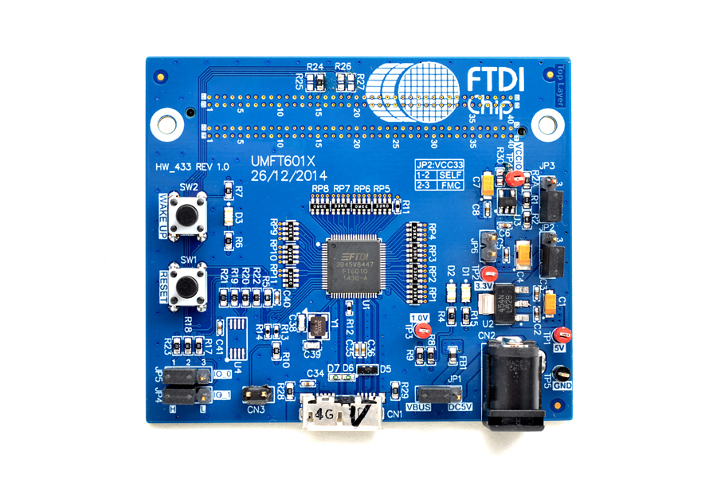

.. DFS documentation master file, created by
   sphinx-quickstart on Wed Dec 21 17:13:49 2016.
   You can adapt this file completely to your liking, but it should at least
   contain the root `toctree` directive.

.. toctree::
   :maxdepth: 2
   :numbered:
   :caption: Contents:
   

Introduction
============

This document describes the reliability analysis done on the "SPEC" card developped by the CERN in the context of the OHWR project. The final goal of this analysis is to compute the "Mean Time Between Failures" or MTBF of the whole card.

Circuit overview
================

.. image:: img/spec_v1.1_top.JPG

The proposed Circuit is made of a single PCB. This PCB is a FGPA card meant to be used inside a PC connected trought the PCI-Express (PCIe) bus. The card also offers a FMC connector and SFP interface. FMC stand for "FPGA Mezzanine Connector", it is an open standard that propose standardized between a FPGA board and mezzanine cards. SFP is a generic connector for cooper and fiber based Ethernet. The following picture is an example of FMC mezzanine cards:

This card can be also utilized stand-alone thanks to a power connector, USB to serial brige and USB JTAG interface.

This card can be decomposed in the follwoing blocks:

FPGA
  The Xill inx Spartan 6FGPA is the central piece of this circuit.
  
PCIe Bridge
  This block is converting the PCIe signal to signal that can be interfaced to the FPGA. This block is build around the Genum GN4124 IC.
  
DDR
  The RAM for the FPGA.

PSU
  Power supply for the whole circuit.

Theorical background
====================

The reliablity of a PCB cicrcuit can be calucated using the guide lines described in the IEC-62380. Other standard applies to specific domains, but IEC-62380 can be used in general cases.

The key parameter for reliablity calculation is the "failure rate", denoted \lambda and expressed in "FIT". FIT stands for "Failures In Time". One FIT represent on failure per 10^9 hours. 

IEC 62300
---------

FIT calculation
---------------

Survival probality
------------------

Analysis
========

Per-component failure rate
--------------------------

.. image:: img/FIT_table.png

.. image:: img/FR_dist_by_type.png

Per-block failure rate
----------------------

.. image:: img/FR_dist_by_func.png

Circuit failure rate
--------------------

Conclusion
==========

