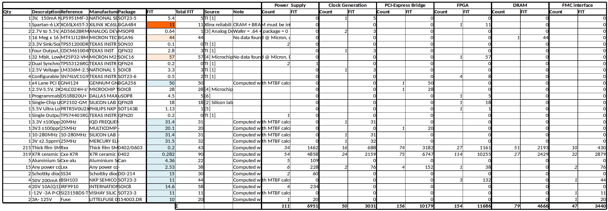
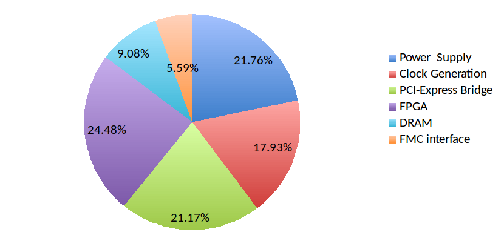

.. DFS documentation master file, created by
   sphinx-quickstart on Wed Dec 21 17:13:49 2016.
   You can adapt this file completely to your liking, but it should at least
   contain the root `toctree` directive.

.. toctree::
   :maxdepth: 2
   :numbered:
   :caption: Contents:
   

Introduction
============

This document describes the reliability analysis done on the "SPEC" card developped by the CERN in the context of the OHWR project. The final goal of this analysis is to compute the "Mean Time Between Failures" or MTBF of the whole card.

Circuit overview
================

.. image:: img/spec_v1.1_top.JPG

The proposed Circuit is made of a single PCB. This PCB is a FGPA card meant to be used inside a PC connected trought the PCI-Express (PCIe) bus. The card also offers a FMC connector and SFP interface. FMC stand for "FPGA Mezzanine Connector", it is an open standard that propose standardized between a FPGA board and mezzanine cards. SFP is a generic connector for cooper and fiber based Ethernet. The following picture is an example of FMC mezzanine cards:

.. image:: img/UMFT601X.jpg

This card can be also utilized stand-alone thanks to a power connector, USB to serial brige and USB JTAG interface.

This card can be decomposed in the follwoing blocks:

FPGA
  The Xill inx Spartan 6FGPA is the central piece of this circuit.
  
PCIe Bridge
  This block is converting the PCIe signal to signal that can be interfaced to the FPGA. This block is build around the Genum GN4124 IC.
  
DDR
  The RAM for the FPGA.

PSU
  Power supply for the whole circuit.
  
From this, the following block scheme can be drawn:

.. image:: img/Block_diagram.png

Theorical background
====================

FIT calculation
---------------

The key parameter for reliablity calculation is the "failure rate", denoted :math:`\lambda` and expressed in "FIT". FIT stands for "Failures In Time". One FIT represent on failure per :math:`10^9` hours, or :math:`10^{-9}` failure per hours. The "Mean Time Between Failures" or MTBF is the inverse of the FIT:

.. math::
    MTBF = \frac{10^9}{\lambda}

The failure rate of a complex system, here a fitted PCB, can be calculated from the FIT from the components it is made of. When the component or sub-system are inter-dependent (when the failure of one component affects another) FIT can be added.

.. math::
    \lambda_{T} = \lambda_{IC1} + \lambda_{IC2}
    
When two component of sub-systems are redondant (the same function is implemented twice), FIT can be calculated as follow:

.. math::
    \lambda _{T} = \frac{1}{ \frac{1}{ \lambda_{IC1}} + \frac{1}{\lambda_{IC2} } }
    

IEC 62300
---------

The reliablity of a PCB cicrcuit can be calucated using the guide lines described in the IEC-62380. Other standard applies to specific domains (Space, Aero, etc..) or companies, but IEC-62380 can be used in general cases for Electronics.

This norm gives equation to computes the failure rate in FITs of all component encounter on an electronic circuits as whel equation to compute the reliability of the bare PCB and finaly to compute the Failure rate of the whole assembled PCB. 

The norm start by giving the equation to compute the FITs for an assembled PCB:

.. image:: img/IEC-62380-6.1.png

This tells that the the failure rate of the assebled PCB is the failure rate of the components an connections (**A** in the equations) plus the failure rate of the bare PCB (**B** in the equation).

Then the norm gives the equation to compute the failure rate of the bare PCB as follow:

.. image:: img/IEC-62380-B.png

And the failure rate of components and connections:

.. image:: img/IEC-62380-A.png

The norms then gives equation to compute the failure rate of all different components that one can find on a PCB board (transistors, diodes, passives, ICs, etc..). Here after is an example for a low power transistor:

.. image:: img/IEC-62380-8.4.png

This norms can guide the reliabilty engineer to manualy calculate the reliability of the designed PCB cuircuit. However, we can see that the aboves equations are faireley complicated. Such a manual calculation can take some time. Luckly, there the "MTBF calculator by ALD" can help. This program use all the equations given in the norm to compute the MTBF for all component type for all majors norms. This program is available as a freeware at http://aldservice.com/Reliability-Software/free-mtbf-calculator.html.

Survival probality
------------------

Analysis
========

Per-component failure rate
--------------------------

.. image:: img/FR_dist_by_type.png

Per-block failure rate
----------------------

Circuit failure rate
--------------------

Conclusion
==========

